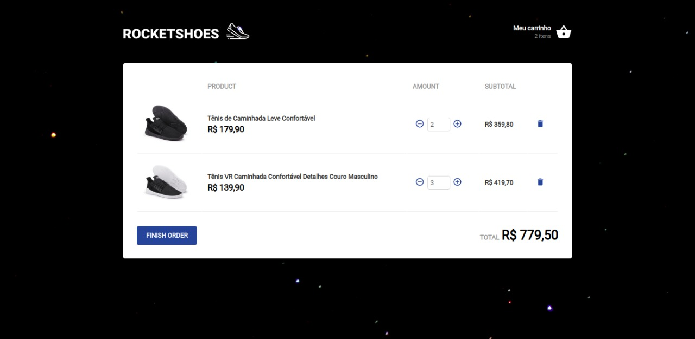

# Rocketshoes :athletic_shoe: :rocket:

First contact with Redux and Redux Saga. I could  really see the power of it when having an application with multiple components that need to share states.




## Run this project

**Install the dependencies**

Yarn
```bash
yarn
```

---

Npm
```bash
npm install
```
---
**Start the Json Server**

```bash
 yarn json-server server.json -p 3333
```
---
**Start the app**

Yarn
```bash
yarn start
```
---
Npm
```bash
npm start
```
